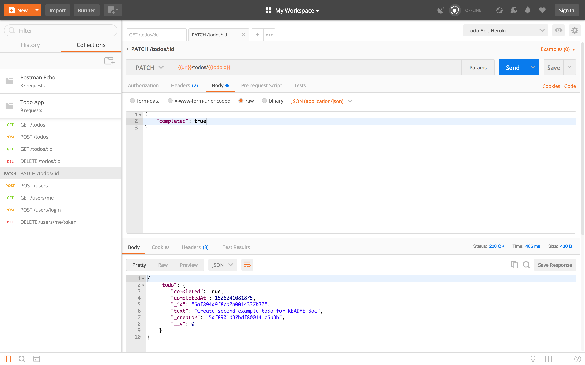

# Node-ToDo-API
This is a NODE REST API that I created for any developer to utilize in order to make an application that keeps a list of "todo" notes. The API has full CRUD capabilities where users can Create, Read, Update, and Delete the todo notes that they have made. All of the information created by the API is stored in a MongoDB database. The API is built with ES6 JavaScript and JSON, while using node packages like mongodb, mongoose, express, body-parser, lodash, validator, and jsonwebtokens. There are also several dev dependencies for testing like mocha, expect, and supertest.

Below I will show some examples of the API functionality and routes using Postman. I will be using the URL of the API that I have deployed to heroku which is: https://todoapi1221.herokuapp.com/

---

- The first thing the user will have to do is create new user credentials. This is done by going to the POST /users route on the API and entering an email address and password.

- Once the email and password is sent a new user document is created in the mongo database. Below is a screenshot from Robo 3T that shows the new document with a unique id, email, encrypted password, and a x-auth web token for the user.

- Now that the user has an account, they can create a "todo" item. By going to the POST /todos route the user can enter the text of what they would like to get done on their todo list. Once the text is submitted a new todo document is created with _id, _creator, text, completed, and completedAt fields.

- Below is another example of a todo item being created using the POST /todos route.

- The user can view all of their todo documents by going to the GET /todos route.

- The user can view a specific todo document by going to the GET /todos/todo-id route. By entering the ID of the todo document at the end of the url they will be able to view the specific todo that they are looking for.

- By going to the PATCH /todos/todo-id route the user can mark the todo item as completed. Once this is submitted the todo document will be updated for the completed field to be set to true and the completedAt field will have a timestamp to mark when it was completed. The user can also reverse this step if they wanted to reset the todo document as not completed.

- The user can delete a todo item by going to the DELETE /todo/todo-id route. Once submitted the deleted todo document will be shown to the user.

- By going to the DELETE /users/me/token route the user will be logged out of the API.

